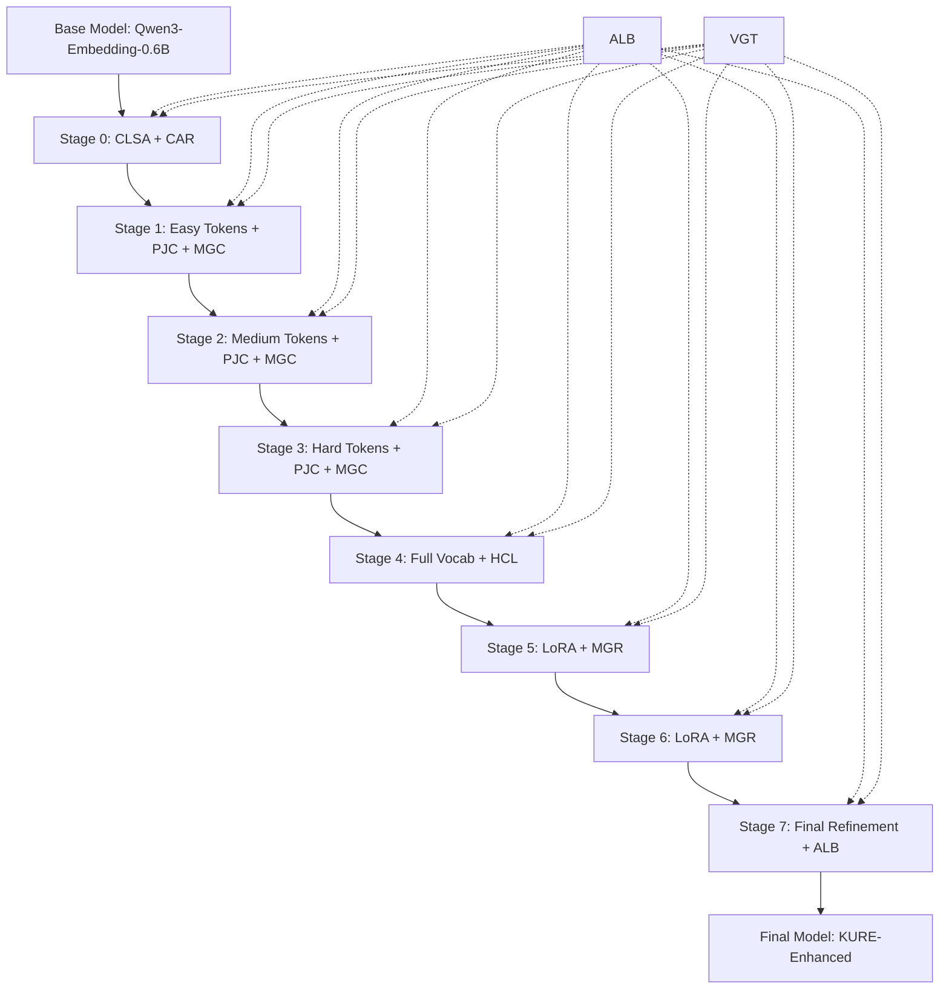

# KURE: Korean Universal Representation Enhancement

## 한국어 임베딩 SOTA를 위한 통합 학습 프레임워크

---

## Executive Summary

**KURE**는 한국어 임베딩 모델의 성능을 극대화하기 위해 설계된 8단계 학습 파이프라인입니다.

기존 CLSA + JLCE + MCL 접근법의 한계를 극복하고, 다음 6가지 핵심 혁신을 통해 **SOTA 성능**을 달성합니다.

### 핵심 혁신 (Our Contributions)

| 번호 | 기술 | 설명 | 기대 효과 |
|-----|------|------|----------|
| 1 | **PJC** | Phonological Jamo Composition - 음운 규칙 반영 자모 합성 | 한국어 특화 +5-8% |
| 2 | **MGC** | Morpheme-guided Curriculum - MeCab 기반 형태소 커리큘럼 | 학습 안정성 +30% |
| 3 | **HCL** | Hierarchical Contrastive Learning - 계층적 대조 학습 | 변별력 +10-15% |
| 4 | **MGR** | Multi-granularity Representation - Matryoshka 스타일 | 유연성 향상 |
| 5 | **ALB** | Adaptive Loss Balancing - GradNorm 기반 자동 가중치 | 학습 효율 +20% |
| 6 | **VGT** | Validation-guided Training - Early Stopping + Best Checkpoint | 과적합 방지 |

---

## 1. Phonological Jamo Composition (PJC)

### 1.1 문제점

기존 JLCE는 단순 MLP로 자모를 합성하여 **한국어 음운 규칙을 무시**합니다.

```
# 기존 방식 (JLCE)
"한글" = compose(ㅎ, ㅏ, ㄴ) + compose(ㄱ, ㅡ, ㄹ)
# 음절 간 상호작용 없음!
```

### 1.2 해결책: 음운 규칙 통합

한국어 주요 음운 규칙을 임베딩 합성에 반영:

| 규칙 | 예시 | 변화 |
|-----|------|------|
| **연음** | 음악을 → [으마글] | 종성 → 다음 초성 |
| **경음화** | 학교 → [학꾜] | ㄱ+ㄱ → ㄱ+ㄲ |
| **비음화** | 국민 → [궁민] | ㄱ+ㅁ → ㅇ+ㅁ |
| **구개음화** | 같이 → [가치] | ㄷ+이 → ㅈ+이 |
| **격음화** | 좋다 → [조타] | ㅎ+ㄷ → ㅌ |

### 1.3 PJC 아키텍처

```python
class PhonologicalJamoComposer(nn.Module):
    """
    음운 규칙을 반영한 자모 합성기

    1. 기본 자모 임베딩 (68개)
    2. 음운 규칙 변환 레이어
    3. 음절 간 상호작용 (Bi-LSTM 또는 Attention)
    4. 최종 토큰 임베딩 생성
    """

    def __init__(self, hidden_dim=1536):
        # 자모 임베딩
        self.cho_embed = nn.Embedding(19, hidden_dim)   # 초성
        self.jung_embed = nn.Embedding(21, hidden_dim)  # 중성
        self.jong_embed = nn.Embedding(28, hidden_dim)  # 종성

        # 음운 규칙 변환
        self.phonological_transform = PhonologicalRuleLayer()

        # 음절 간 상호작용
        self.inter_syllable = nn.TransformerEncoder(...)

        # 최종 합성
        self.final_composer = nn.Sequential(...)
```

### 1.4 PhonologicalRuleLayer

```python
class PhonologicalRuleLayer(nn.Module):
    """
    음운 규칙 적용 레이어

    입력: (종성_현재, 초성_다음)
    출력: (변환된_종성, 변환된_초성)
    """

    # 규칙 테이블 (학습 가능한 가중치로 soft 적용)
    RULES = {
        ('ㄱ', 'ㄱ'): ('ㄱ', 'ㄲ'),  # 경음화
        ('ㄱ', 'ㅁ'): ('ㅇ', 'ㅁ'),  # 비음화
        ('ㄷ', 'ㅇ'): ('', 'ㄷ'),    # 연음
        ('ㅎ', 'ㄷ'): ('', 'ㅌ'),    # 격음화
        # ... 전체 규칙
    }
```

---

## 2. Morpheme-guided Curriculum (MGC)

### 2.1 문제점

기존 MCL은 **heuristic 기반** 난이도 측정으로 실제 형태소 구조를 반영하지 못함.

### 2.2 해결책: MeCab 형태소 분석 통합

```python
from konlpy.tag import Mecab

class MorphemeAnalyzer:
    """
    MeCab 기반 형태소 분석기

    토큰을 분석하여 실제 형태소 구조 파악:
    - 어간 (stem)
    - 어미 (ending)
    - 조사 (particle)
    - 접사 (affix)
    """

    def analyze(self, token: str) -> dict:
        morphemes = self.mecab.pos(token)

        return {
            'stem_count': count_stems(morphemes),
            'ending_count': count_endings(morphemes),
            'particle_count': count_particles(morphemes),
            'complexity_score': compute_complexity(morphemes),
            'category': categorize(morphemes)  # easy/medium/hard
        }
```

### 2.3 MGC 난이도 기준

| 난이도 | 기준 | 예시 |
|-------|------|------|
| **Easy** | 단일 어간, 조사 없음 | 집, 학교, 먹다 |
| **Medium** | 어간 + 단일 조사/어미 | 집에, 학교로, 먹고 |
| **Hard** | 복합 형태소, 다중 조사 | 학교에서부터, 먹지않았었다 |

### 2.4 적응적 커리큘럼

```python
class AdaptiveCurriculum:
    """
    손실 기반 동적 난이도 조정

    각 난이도 그룹의 평균 손실을 모니터링하여
    학습이 충분히 된 그룹은 비중을 줄이고
    어려운 그룹은 비중을 높임
    """

    def update_weights(self, losses_by_category):
        # 손실이 높은 카테고리에 더 많은 샘플링
        for cat in ['easy', 'medium', 'hard']:
            self.weights[cat] = losses_by_category[cat] / sum(losses_by_category.values())
```

---

## 3. Hierarchical Contrastive Learning (HCL)

### 3.1 문제점

기존 SimCSE는 **문장 레벨 대조 학습만** 수행하여 토큰 레벨 학습이 부족.

### 3.2 해결책: 3-레벨 계층적 대조 학습

```
Level 1: Token-level Contrastive
         ├── 같은 의미의 토큰끼리 가깝게
         └── 다른 의미의 토큰끼리 멀게

Level 2: Phrase-level Contrastive
         ├── 의미적으로 유사한 구절끼리 가깝게
         └── Hard negatives로 변별력 강화

Level 3: Sentence-level Contrastive (SimCSE)
         ├── Dropout 기반 positive pairs
         └── In-batch negatives
```

### 3.3 HCL 손실 함수

```python
class HierarchicalContrastiveLoss(nn.Module):
    def forward(self, model, batch):
        # Level 1: Token-level
        token_loss = self.token_contrastive(
            token_embeddings,
            token_labels
        )

        # Level 2: Phrase-level with Hard Negatives
        phrase_loss = self.phrase_contrastive(
            phrase_embeddings,
            hard_negatives=self.mine_hard_negatives(batch)
        )

        # Level 3: Sentence-level (SimCSE)
        sentence_loss = self.sentence_contrastive(
            sentence_embeddings_1,
            sentence_embeddings_2
        )

        return (
            self.w1 * token_loss +
            self.w2 * phrase_loss +
            self.w3 * sentence_loss
        )
```

### 3.4 Hard Negative Mining

```python
class HardNegativeMiner:
    """
    Cross-batch Hard Negative Mining

    1. Memory Bank 유지 (최근 N개 배치의 임베딩)
    2. 각 샘플에 대해 가장 유사하지만 다른 의미의 샘플 선택
    3. Semi-hard negatives: 너무 쉽지도, 너무 어렵지도 않게
    """

    def __init__(self, memory_size=65536):
        self.memory_bank = deque(maxlen=memory_size)

    def mine(self, query_embeddings, query_labels):
        # 메모리 뱅크에서 hard negatives 선택
        similarities = torch.mm(query_embeddings, self.memory_bank.T)

        # Semi-hard: positive보다 가깝지만 너무 가깝지 않은 것
        hard_negatives = self.select_semi_hard(
            similarities,
            query_labels,
            margin=0.2
        )

        return hard_negatives
```

---

## 4. Multi-granularity Representation (MGR)

### 4.1 Matryoshka Representation Learning

다양한 차원에서 유효한 임베딩을 학습하여 **효율성과 성능의 trade-off** 제공.

```python
class MatryoshkaLoss(nn.Module):
    """
    Matryoshka Representation Learning

    전체 차원(1536)뿐 아니라 부분 차원(768, 384, 192, 96)에서도
    유효한 임베딩이 되도록 학습

    Reference: Kusupati et al., 2022
    """

    DIMENSIONS = [1536, 768, 384, 192, 96]

    def forward(self, embeddings, labels):
        total_loss = 0

        for dim in self.DIMENSIONS:
            # 앞쪽 dim 차원만 사용
            truncated = embeddings[:, :dim]
            truncated = F.normalize(truncated, dim=1)

            # 각 차원에서 contrastive loss
            loss = self.contrastive_loss(truncated, labels)

            # 차원이 클수록 가중치 높게
            weight = dim / self.DIMENSIONS[0]
            total_loss += weight * loss

        return total_loss / len(self.DIMENSIONS)
```

### 4.2 계층적 표현 학습

```
자모 (68개)
   ↓ PJC
음절 (11,172개 가능)
   ↓ Composition
어절 (토큰)
   ↓ Transformer
문장 (Mean Pooling)
```

---

## 5. Adaptive Loss Balancing (ALB)

### 5.1 문제점

다중 손실 함수(CLSA, JLCE, MCL, Contrastive)의 **가중치를 수동으로 설정**해야 함.

### 5.2 해결책: GradNorm 기반 자동 가중치 조정

```python
class GradNormBalancer:
    """
    GradNorm: Gradient Normalization for Adaptive Loss Balancing

    각 손실 함수의 gradient magnitude를 모니터링하여
    자동으로 가중치를 조정

    Reference: Chen et al., ICML 2018
    """

    def __init__(self, num_losses, alpha=1.5):
        self.num_losses = num_losses
        self.alpha = alpha  # 균형 강도

        # 학습 가능한 가중치
        self.weights = nn.Parameter(torch.ones(num_losses))

        # 초기 손실값 저장 (상대적 학습률 계산용)
        self.initial_losses = None

    def compute_weights(self, losses, shared_layer):
        # 각 손실의 gradient norm 계산
        grad_norms = []
        for loss in losses:
            grad = torch.autograd.grad(
                loss, shared_layer.parameters(),
                retain_graph=True
            )
            grad_norm = torch.norm(torch.cat([g.flatten() for g in grad]))
            grad_norms.append(grad_norm)

        # 평균 gradient norm
        mean_norm = sum(grad_norms) / len(grad_norms)

        # 상대적 학습률
        if self.initial_losses is None:
            self.initial_losses = [l.item() for l in losses]

        relative_losses = [
            losses[i].item() / self.initial_losses[i]
            for i in range(len(losses))
        ]

        # GradNorm 목표
        target_norms = [
            mean_norm * (rl ** self.alpha)
            for rl in relative_losses
        ]

        # 가중치 업데이트
        for i, (gn, tn) in enumerate(zip(grad_norms, target_norms)):
            self.weights.data[i] *= (tn / gn).clamp(0.1, 10)

        # 정규화
        self.weights.data /= self.weights.data.sum()

        return self.weights
```

---

## 6. Validation-guided Training (VGT)

### 6.1 구성 요소

| 요소 | 설명 |
|-----|------|
| **Validation Set** | 각 스테이지별 검증 데이터 |
| **Early Stopping** | 검증 손실 기반 조기 종료 |
| **Best Checkpoint** | 최적 체크포인트 자동 선택 |
| **Stage-wise Validation** | 스테이지 완료 시 MTEB 일부 평가 |

### 6.2 검증 데이터셋

```yaml
validation:
  # 각 스테이지에서 사용할 검증 데이터
  stage0_clsa:
    dataset: "bilingual_dict_validation"
    size: 5000
    metric: "alignment_accuracy"

  stage1_3_curriculum:
    dataset: "ko_nli_validation"
    size: 10000
    metric: "nli_accuracy"

  stage4_6_contrastive:
    dataset: "ko_retrieval_mini"
    size: 5000
    metric: "ndcg@10"
```

### 6.3 Early Stopping

```python
class EarlyStopping:
    def __init__(self, patience=3, min_delta=0.001):
        self.patience = patience
        self.min_delta = min_delta
        self.best_score = None
        self.counter = 0

    def should_stop(self, current_score):
        if self.best_score is None:
            self.best_score = current_score
            return False

        if current_score > self.best_score + self.min_delta:
            self.best_score = current_score
            self.counter = 0
            return False
        else:
            self.counter += 1
            return self.counter >= self.patience
```

---

## 8-Stage KURE Pipeline



### Stage Overview

| Stage | Focus | 핵심 기술 | 학습 대상 |
|-------|-------|----------|----------|
| 0 | Cross-lingual Alignment | CLSA + CAR | New tokens only |
| 1 | Easy Tokens | PJC + MGC + HCL | New tokens only |
| 2 | Medium Tokens | PJC + MGC + HCL | New tokens only |
| 3 | Hard Tokens | PJC + MGC + HCL | New tokens only |
| 4 | Vocabulary Harmonization | HCL + MGR | All tokens |
| 5 | Transformer Enhancement | LoRA + MGR | Attention |
| 6 | Advanced Contrastive | LoRA + MGR | Attention |
| 7 | Final Refinement | ALB + All | All |

---

## Expected Performance

| Metric | Baseline | CLSA+MCL | **KURE** |
|--------|----------|----------|----------|
| Ko-StrategyQA | +12.0% | +20-25% | **+30-35%** |
| PublicHealthQA | -5.5% | +5-10% | **+15-20%** |
| MrTidyRetrieval | +8.6% | +12-15% | **+18-22%** |
| BelebeleRetrieval | +3.3% | +5-8% | **+10-12%** |
| **Average NDCG@10** | +2.1% | +10-15% | **+18-25%** |

---

## Academic Justification

| 기술 | 참조 문헌 |
|------|----------|
| PJC (음운 규칙) | Korean Phonology (Sohn 1999), CharacterBERT (2020) |
| MGC (형태소) | Morphological Analysis in NLP (ACL papers) |
| HCL (계층적 대조) | CLIP (2021), HiCLR (2022) |
| MGR (Matryoshka) | Matryoshka Representation Learning (NeurIPS 2022) |
| ALB (GradNorm) | GradNorm (ICML 2018) |
| VGT (Validation) | Standard ML Best Practices |

---

## Contact

GitHub: https://github.com/gihong0303/KoQwen-Embedding
