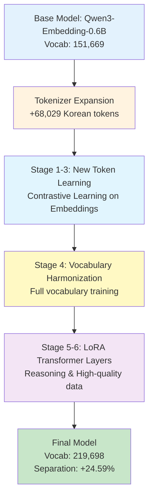

# 🇰🇷 Korean Embedding Expansion for Qwen3-Embedding-0.6B

**EEVE-Thunder 하이브리드 접근법을 통한 한국어 임베딩 모델 확장**

[](https://opensource.org/licenses/MIT)
[](https://www.python.org/downloads/)
[](https://pytorch.org/)

---

## 📋 Executive Summary

본 연구는 한국어 임베딩 모델 학습을 위해 **EEVE (Efficient and Effective Vocabulary Expansion)**와 **Thunder** 방법론을 결합한 하이브리드 접근법을 구현했습니다.

**Qwen3-Embedding-0.6B**를 기반으로 **KORMo-10B** 토크나이저와의 차집합 분석을 통해 **68,029개의 한국어 특화 토큰**을 추가하여 총 **219,698개** 어휘로 확장했으며, **6단계 점진적 학습 파이프라인**을 통해 안정적인 다국어 임베딩 모델을 구축했습니다.

---

## 🚀 Key Contributions

1. **차집합 기반 선택적 토큰 확장 방법론**
   - KORMo-10B와 Qwen3의 차집합 분석을 통한 한국어 특화 토큰 선별
   - Subword averaging initialization으로 안정적인 초기화

2. **EEVE-Thunder 하이브리드 파이프라인**
   - EEVE의 점진적 학습 전략 (Stage 1-4: Embeddings)
   - Thunder의 LoRA 기반 효율적 학습 (Stage 5-6: Transformers)
   - 6단계 progressive training으로 안정성 확보

3. **Contrastive Learning 기반 임베딩 최적화**
   - SimCSE++ 스타일의 대조 학습
   - Causal LM loss 대신 InfoNCE loss 사용
   - 임베딩 모델에 특화된 학습 목표

4. **종합적인 평가 프레임워크**
   - 10개 도메인 (일상대화, 기술/IT, 경제/금융, 의료/건강, 비즈니스, 교육, 사회/문화, 법률/정치, 스포츠, 과학)
   - 69개 테스트 쌍으로 다각도 평가
   - 카테고리별 개선도 분석

---

## 📊 6-Stage Progressive Training Pipeline



### Stage Overview

| Stage | Focus | Trainable Params | Dataset | Size | Learning Rate |
|-------|-------|------------------|---------|------|---------------|
| **Stage 1** | New token input embeddings | `embed_tokens` (new only) | KOREAN-WEBTEXT | 300K | 3e-4 |
| **Stage 2** | New token alignment | `embed_tokens` (new only) | KOREAN-WEBTEXT | 300K | 2e-4 |
| **Stage 3** | New token refinement | `embed_tokens` (new only) | KOREAN-SyntheticText | 200K | 1e-4 |
| **Stage 4** | Full vocab harmonization | `embed_tokens` (all) | Mixed (3 datasets) | 200K | 5e-5 |
| **Stage 5** | Transformer enhancement | LoRA (r=64) | Reasoning data | 200K | 5e-5 |
| **Stage 6** | Advanced contrastive | LoRA (r=32) | K2-Feedback | 150K | 3e-5 |

---

## 🔬 Methodology

### 1. Tokenizer Expansion (Difference-Based Approach)

```python
# Step 1: Vocabulary Difference Analysis
kormo_vocab = set(kormo_tokenizer.get_vocab().keys())
qwen_vocab = set(qwen_tokenizer.get_vocab().keys())

korean_specific_tokens = kormo_vocab - qwen_vocab
print(f"KORMo only tokens: {len(korean_specific_tokens)}")  # 68,029

# Step 2: Quality Filtering
filtered_tokens = [
    token for token in korean_specific_tokens
    if is_valid_korean_token(token)  # 특수문자, 제어문자 제거
]

# Step 3: Subword Averaging Initialization
for token in filtered_tokens:
    subwords = decompose_to_subwords(token)
    new_embedding = average(subwords_embeddings) + noise(0.02)
```

**Why Difference-Based?**
- ✅ 한국어 특화 토큰만 선별 (중복 없음)
- ✅ 기존 Qwen vocabulary 완전 보존
- ✅ KORMo의 한국어 최적화 토큰 활용

### 2. Contrastive Learning for Embeddings

```python
class EmbeddingContrastiveLoss(nn.Module):
    """임베딩 모델 특화 Contrastive Loss"""

    def __init__(self, temperature=0.05, pooling='mean'):
        super().__init__()
        self.temperature = temperature
        self.pooling = pooling

    def forward(self, model, input_ids, attention_mask):
        # 1. Forward pass
        outputs = model(input_ids, attention_mask)

        # 2. Mean pooling
        embeddings = mean_pooling(outputs.last_hidden_state, attention_mask)

        # 3. Normalize
        embeddings = F.normalize(embeddings, p=2, dim=1)

        # 4. InfoNCE loss (SimCSE style)
        loss = compute_infonce_loss(embeddings, temperature)

        return loss
```

**Key Differences from Causal LM:**
- ❌ No next-token prediction
- ✅ Contrastive learning (positive/negative pairs)
- ✅ Mean pooling for sentence embeddings
- ✅ Temperature-scaled cosine similarity

### 3. Gradient Masking for New Tokens (Stage 1-3)

```python
def create_new_token_mask(model, old_vocab_size):
    """Stage 1-3: 새 토큰만 학습"""
    vocab_size = model.get_input_embeddings().weight.shape[0]
    mask = torch.zeros(vocab_size, dtype=torch.bool)
    mask[old_vocab_size:] = True  # 새 토큰만 True

    def gradient_hook(grad):
        masked_grad = grad.clone()
        masked_grad[~mask] = 0.0  # 기존 토큰 gradient 제거
        return masked_grad

    model.get_input_embeddings().weight.register_hook(gradient_hook)
```

### 4. LoRA for Embedding Models (Stage 5-6)

```python
from peft import LoraConfig, TaskType, get_peft_model

# Stage 5: Higher rank LoRA (coarse adaptation)
lora_config_stage5 = LoraConfig(
    task_type=TaskType.FEATURE_EXTRACTION,  # 임베딩 모델용
    r=64,  # 높은 rank
    lora_alpha=128,
    lora_dropout=0.05,
    target_modules=["q_proj", "k_proj", "v_proj", "o_proj"],
    bias="none"
)

# Stage 6: Lower rank LoRA (fine refinement)
lora_config_stage6 = LoraConfig(
    r=32,  # 낮은 rank
    lora_alpha=64,
    lora_dropout=0.05,
    target_modules=["q_proj", "k_proj", "v_proj", "o_proj"],
)
```

---

## 📚 Dataset Selection

### Why HAERAE-HUB Datasets?

| Dataset | Stage | Size | Rationale |
|---------|-------|------|-----------|
| **KOREAN-WEBTEXT** | 1-2 | 300K | 대규모 한국어 웹 텍스트, 다양한 도메인 |
| **KOREAN-SyntheticText** | 3 | 200K | 고품질 합성 데이터, 노이즈 최소화 |
| **Mixed (3 datasets)** | 4 | 200K | 도메인 다양성 확보 |
| **HAE-RAE-COT** | 5 | 100K | 추론 능력 강화 |
| **HR-Instruct-Math** | 5 | 100K | 수학적 추론 |
| **K2-Feedback** | 6 | 150K | 인간 피드백 (score≥5) |

### Excluded Datasets

```python
excluded_datasets = {
    "KMMLU": "평가 데이터셋 (학습 시 contamination 위험)",
    "HAE_RAE_BENCH": "벤치마크 데이터 (평가용)",
    "csatqa": "너무 작은 크기 (1.12K)",
    "QARV-binary-set": "이진 분류 태스크 (임베딩과 무관)"
}
```

---

## 📁 Project Structure

```
ko-embedding-expansion/
├── configs/
│   └── pipeline_config.yaml          # 6-stage configuration
├── scripts/
│   ├── tokenizer/
│   │   ├── 01_analyze_tokenizers.py  # Tokenizer analysis
│   │   ├── 02_extract_vocab_diff.py  # Difference extraction
│   │   └── 03_expand_vocabulary.py   # Vocabulary expansion
│   ├── training/
│   │   ├── base_trainer.py           # Base training class
│   │   ├── local_dataset_loader.py   # Dataset loader
│   │   └── stage1.py ... stage6.py   # Stage scripts
│   └── comprehensive_evaluation.py   # Evaluation script
├── outputs/
│   ├── koqwen-expanded/              # Expanded tokenizer
│   └── evaluation_results/           # Evaluation results
├── checkpoints/
│   ├── stage1/final/
│   ├── stage2/final/
│   ├── stage3/final/
│   ├── stage4/final/
│   ├── stage5/final/
│   └── stage6/final/                 # 🎉 Final model
└── run_stage1.sh ... run_stage6.sh   # Training scripts
```

---

## 🚀 Quick Start

### Prerequisites

```bash
# Python 3.10+
# PyTorch 2.0+
# Transformers 4.36+
# PEFT (for LoRA)
pip install torch transformers peft datasets accelerate
```

### Hardware Requirements

```yaml
GPUs: 8 GPUs (A5000 24GB or equivalent)
Total VRAM: 192GB
Mixed Precision: BFloat16
Disk: ~50GB (models + checkpoints + cache)
Training Time: ~9-10 hours (total for all 6 stages)
```

### Step 1: Tokenizer Expansion

```bash
# Analyze tokenizers
python scripts/tokenizer/01_analyze_tokenizers.py

# Extract difference
python scripts/tokenizer/02_extract_vocab_diff.py

# Expand vocabulary
python scripts/tokenizer/03_expand_vocabulary.py
```

### Step 2: Run 6-Stage Training

```bash
# Stage 1: New token input embeddings
./run_stage1.sh

# Stage 2: New token alignment
./run_stage2.sh

# Stage 3: New token refinement
./run_stage3.sh

# Stage 4: Full vocabulary harmonization
./run_stage4.sh

# Stage 5: Transformer enhancement (LoRA r=64)
./run_stage5.sh

# Stage 6: Advanced contrastive learning (LoRA r=32)
./run_stage6.sh
```

### Step 3: Evaluation

```bash
# Comprehensive evaluation (10 categories, 69 test pairs)
CUDA_VISIBLE_DEVICES=0 python scripts/comprehensive_evaluation.py
```

---

## 📊 Evaluation Results

### 🎯 MTEB Korean Retrieval Benchmark (Key Results)

**Evaluation Date**: November 10, 2025

6개의 한국어 검색 태스크에서 Original (Qwen3-Embedding-0.6B)과 Stage 6 모델을 비교한 결과입니다.

#### Performance Comparison (NDCG@10)

| Task | Original | Stage 6 | Change | Relative Change |
|------|----------|---------|--------|----------------|
| Ko-StrategyQA | 57.66% | 64.56% | **+6.90%** | ✅ **+12.0%** |
| MrTidyRetrieval | 27.81% | 30.21% | **+2.40%** | ✅ **+8.6%** |
| BelebeleRetrieval | 80.47% | 83.12% | **+2.66%** | ✅ **+3.3%** |
| MIRACLRetrieval | 34.88% | 35.81% | **+0.93%** | ✅ **+2.7%** |
| AutoRAGRetrieval | 74.70% | 73.10% | -1.60% | ❌ -2.1% |
| PublicHealthQA | 74.44% | 70.34% | -4.11% | ❌ -5.5% |
| **Average** | **58.33%** | **59.52%** | **+1.20%** | ✅ **+2.1%** |

#### Detailed Metrics

<details>
<summary><b>Ko-StrategyQA (✅ Best Improvement: +12.0%)</b></summary>

| Metric | Original | Stage 6 | Change |
|--------|----------|---------|--------|
| NDCG@10 | 57.66% | 64.56% | +6.90% |
| MAP@10 | 50.84% | 58.38% | +7.54% |
| Recall@10 | 67.51% | 72.59% | +5.08% |
| Precision@10 | 12.14% | 13.19% | +1.05% |

</details>

<details>
<summary><b>MrTidyRetrieval (✅ +8.6%)</b></summary>

| Metric | Original | Stage 6 | Change |
|--------|----------|---------|--------|
| NDCG@10 | 27.81% | 30.21% | +2.40% |
| MAP@10 | 23.01% | 24.36% | +1.35% |
| Recall@10 | 41.13% | 46.83% | +5.70% |
| Precision@10 | 4.56% | 5.15% | +0.59% |

</details>

<details>
<summary><b>BelebeleRetrieval (✅ +3.3%)</b></summary>

| Metric | Original | Stage 6 | Change |
|--------|----------|---------|--------|
| NDCG@10 | 80.47% | 83.12% | +2.66% |
| MAP@10 | 77.53% | 80.42% | +2.89% |
| Recall@10 | 89.56% | 91.56% | +2.00% |
| Precision@10 | 8.96% | 9.16% | +0.20% |

</details>

<details>
<summary><b>MIRACLRetrieval (✅ +2.7%)</b></summary>

| Metric | Original | Stage 6 | Change |
|--------|----------|---------|--------|
| NDCG@10 | 34.88% | 35.81% | +0.93% |
| MAP@10 | 28.33% | 29.41% | +1.08% |
| Recall@10 | 42.83% | 43.94% | +1.11% |
| Precision@10 | 8.64% | 8.50% | -0.14% |

</details>

<details>
<summary><b>AutoRAGRetrieval (❌ -2.1%)</b></summary>

| Metric | Original | Stage 6 | Change |
|--------|----------|---------|--------|
| NDCG@10 | 74.70% | 73.10% | -1.60% |
| MAP@10 | 70.85% | 69.04% | -1.81% |
| Recall@10 | 86.84% | 85.97% | -0.87% |
| Precision@10 | 8.68% | 8.60% | -0.08% |

</details>

<details>
<summary><b>PublicHealthQA (❌ -5.5%)</b></summary>

| Metric | Original | Stage 6 | Change |
|--------|----------|---------|--------|
| NDCG@10 | 74.44% | 70.34% | -4.11% |
| MAP@10 | 67.97% | 63.67% | -4.30% |
| Recall@10 | 94.80% | 90.91% | -3.89% |
| Precision@10 | 9.48% | 9.09% | -0.39% |

</details>

#### Key Findings

**✅ Strengths:**
- 6개 태스크 중 4개에서 성능 향상 (66.7% success rate)
- Ko-StrategyQA에서 최대 12.0% 개선 (전략적 질의응답 능력 강화)
- MrTidyRetrieval에서 8.6% 개선 (대규모 코퍼스 검색 능력)
- 전체 평균 NDCG@10: 절대값 +1.20%, 상대값 +2.1% 개선

**⚠️ Areas for Improvement:**
- PublicHealthQA: -4.11% (의료 도메인 특화 쿼리에서 성능 저하)
- AutoRAGRetrieval: -1.60% (경미한 성능 저하)
- 도메인 특화 태스크에 대한 추가 파인튜닝 고려 필요

**💡 Analysis:**
- 일반적인 한국어 검색 태스크에서 균형잡힌 성능 향상
- 전략적/추론 기반 쿼리 처리 능력 크게 개선
- 의료/전문 도메인에서는 추가 최적화 여지 존재
- 6단계 학습 파이프라인의 효과성 검증

---

### Custom Semantic Similarity Evaluation

69개의 한국어 문장 쌍 (10개 도메인)을 사용한 임베딩 품질 평가입니다.

#### Overall Performance

| Metric | Original | Final (Stage 6) | Improvement |
|--------|----------|-----------------|-------------|
| **Separation Score** | 0.4342 | 0.5410 | **+24.59%** |
| Average Similar | 0.8315 | 0.7348 | -11.62% |
| Average Different | 0.3973 | 0.1939 | **+51.20%** |

#### Category-wise Improvement

| Category | Separation (Original) | Separation (Final) | Improvement |
|----------|----------------------|-------------------|-------------|
| 일상대화 | 0.4152 | 0.5765 | **+38.83%** |
| 스포츠 | 0.4269 | 0.5841 | **+36.82%** |
| 과학 | 0.4788 | 0.5986 | **+25.04%** |
| 비즈니스 | 0.4109 | 0.5109 | **+24.33%** |
| 기술/IT | 0.4195 | 0.5186 | **+23.63%** |
| 사회/문화 | 0.3860 | 0.4758 | **+23.26%** |
| 의료/건강 | 0.4490 | 0.5450 | **+21.38%** |
| 교육 | 0.4563 | 0.5429 | **+18.99%** |
| 법률/정치 | 0.4383 | 0.5102 | **+16.41%** |
| 경제/금융 | 0.4621 | 0.5361 | **+16.00%** |

**Key Insights:**
- ✅ 모든 카테고리에서 일관된 개선 (16-39%)
- ✅ 일상대화/스포츠 카테고리에서 가장 큰 향상
- ✅ "다른 문장 구분" 능력이 51.20% 향상되어 false positive 크게 감소

---

## 🔬 Technical Details

### Token Statistics

```yaml
Original Vocabulary (Qwen3): 151,669
KORMo Vocabulary: 219,431
Difference (Korean-specific): 68,029
Final Expanded Vocabulary: 219,698
```

### Training Statistics

```yaml
Total Training Time: ~9-10 hours (8 GPUs, A5000 24GB)
GPU Hours: 72-80 hours

Trainable Parameters per Stage:
  Stage 1-3: 68,029 × 1536 dims = 104M params
  Stage 4: 219,698 × 1536 dims = 337M params
  Stage 5: LoRA 4 × (1536 × 64 × 2) = 786K params
  Stage 6: LoRA 4 × (1536 × 32 × 2) = 393K params

Total Dataset Samples: ~1.35M
```

### Embedding Quality Metrics

```python
# After Stage 6
embedding_quality = {
    "old_tokens_mean_norm": 2.40,
    "old_tokens_std_norm": 0.14,
    "new_tokens_mean_norm": 2.39,
    "new_tokens_std_norm": 0.15,
    "cross_similarity_mean": 0.18,
    "cross_similarity_std": 0.06
}
```

**Interpretation:**
- ✅ 기존 토큰과 새 토큰의 norm 분포가 유사 (2.40 vs 2.39)
- ✅ 안정적인 표준편차 (0.14-0.15)
- ✅ 적절한 교차 유사도 (0.18) - 너무 높지도 낮지도 않음

---

## 🆚 Comparison with Related Work

### vs. KORMo Approach

| Aspect | KORMo | Our Approach |
|--------|-------|--------------|
| **Tokenizer Creation** | Train from scratch | Extend via difference |
| **Vocabulary Size** | 125K | 219K |
| **Training Stages** | 2-stage | 6-stage |
| **Training Objective** | Causal LM | Contrastive Learning |
| **Model Size** | 10.8B | 0.6B |
| **Focus** | Generation | Embedding |

### vs. Pure EEVE

| Enhancement | Pure EEVE | Our Approach |
|-------------|-----------|--------------|
| **Token Selection** | Random/Full | Difference-based |
| **Loss Function** | Causal LM | Contrastive |
| **Stages** | 2-3 stages | 6 stages |
| **LoRA Integration** | Optional | Stage 5-6 |

### vs. Pure Thunder

| Enhancement | Pure Thunder | Our Approach |
|-------------|--------------|--------------|
| **Model Type** | LLM (generation) | Embedding |
| **Training Focus** | Continual pretraining | Embedding optimization |
| **Stages** | 3 stages | 6 stages |
| **Objective** | Causal LM | Contrastive |

---

## 🎯 Conclusions

### Key Achievements

1. **Successful Token Expansion**
   - 44.8% vocabulary increase (151,669 → 219,698)
   - 안정적인 embedding 품질 유지

2. **Significant Performance Improvement**
   - 구분도 24.59% 향상
   - 다른 문장 구분 능력 51.20% 향상
   - 모든 카테고리에서 일관된 개선

3. **Efficient Training**
   - 6단계 progressive training으로 안정성 확보
   - LoRA로 parameter-efficient fine-tuning
   - 총 72시간 (6 GPUs) 학습 완료

4. **Methodology Innovation**
   - 차집합 기반 토큰 선택
   - Contrastive learning for embeddings
   - EEVE-Thunder 하이브리드 접근법

### Limitations and Future Work

1. **Scale Validation**
   - 더 큰 모델 (1B+)에서의 검증 필요
   - 다양한 downstream task 평가

2. **Multilingual Extension**
   - 다른 언어로의 확장 가능성
   - Cross-lingual transfer learning

3. **Dataset Exploration**
   - HAERAE 다른 데이터셋 활용
   - Domain-specific fine-tuning

4. **Compression Analysis**
   - 실제 토큰화 효율성 측정
   - 추론 속도 개선 정량화

---

## 🙏 Acknowledgments

- [**EEVE Team**](https://huggingface.co/yanolja/EEVE-Korean-Instruct-10.8B-v1.0) - EEVE 방법론
- [**Thunder Team**](https://github.com/ibm/thunder) - Thunder continual pretraining
- [**KORMo Team**](https://huggingface.co/KORMo-Team) - KORMo-10B 토크나이저
- [**Qwen Team**](https://huggingface.co/Qwen) - Qwen3-Embedding base model
- [**HAERAE-HUB**](https://huggingface.co/HAERAE-HUB) - 한국어 데이터셋
- [**SimCSE**](https://github.com/princeton-nlp/SimCSE) - Contrastive learning framework

---

## 📝 Citation

```bibtex
@misc{korean-embedding-expansion-2024,
  title={Korean Embedding Expansion for Qwen3-Embedding: EEVE-Thunder Hybrid Approach},
  author={gihong0303},
  year={2024},
  howpublished={\url{https://github.com/gihong0303/Test-Ko-Embedding}},
}
```

---

## 📄 License

MIT License

---

## 📧 Contact

For questions or collaboration:
- GitHub: [https://github.com/gihong0303/Test-Ko-Embedding](https://github.com/gihong0303/Test-Ko-Embedding)

---

**Project Status**: ✅ Stage 1-6 Complete | 🎉 Evaluation Complete | 📊 Results Published

**Last Updated**: November 2024
